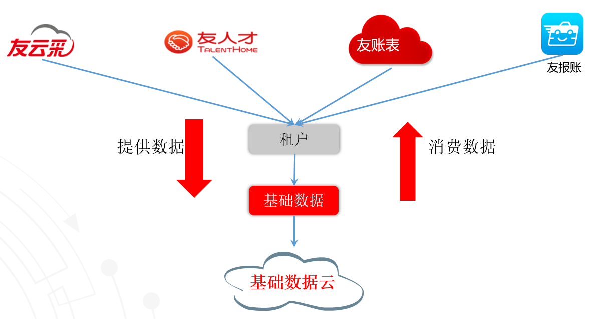

# 典型场景

一、应用之间共享基础数据  

基础数据有创建者，也有使用者，创建者和使用者还可能不在一个应用内，这时，就需要在应用之间进行基础数据共享。如下图所示，不同应用在同一个租户内可以共享基础数据：

二、应用开发增加本应用独有的自定义档案  

虽说基础数据服务提供应用需要的大部分基础数据对象，但是在具体应用开发时，总有应用自己需要的独有的档案，这时，通过自定义档案服务就可以按需定制应用需要的档案。
