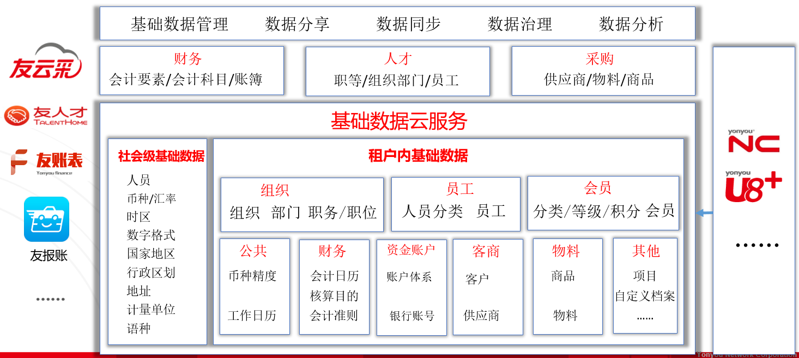

# 概述

在云上提供针对特定类型对象主数据的公共维护管理；以实现大数据的逐步积累沉淀；支持数据化运营，帮助应用逐步形成业务流程闭环的正向反馈；通过基础数据服务，可以支撑各用友云服务基础数据之间进行融合，以沉淀企业服务的基础数据并进行统一治理和数据化运营。

用友云本阶段提供的基础数据服务主要有社会级基础数据服务和租户级基础数据服务，如人员，币种，失去，国家地区，行政区划，地址等社会级基础数据服务；如组织、员工、职务、职位、客户、供应商、商品、物料、项目、银行账户等租户级基础数据。
